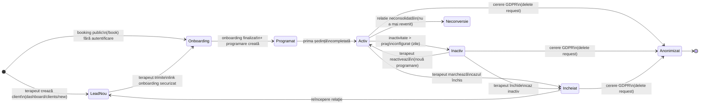
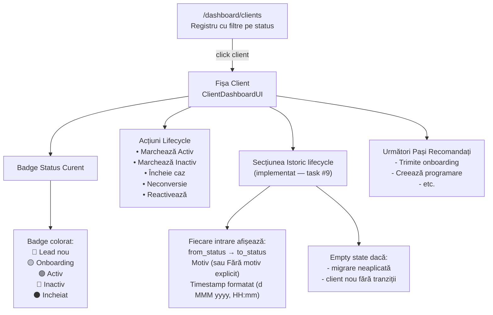
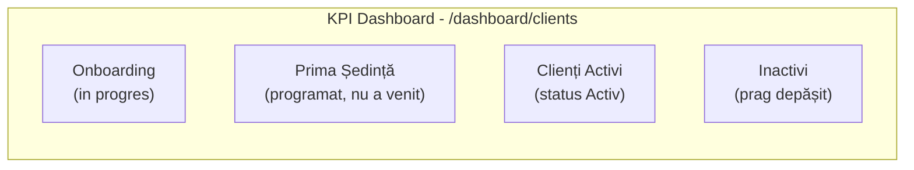
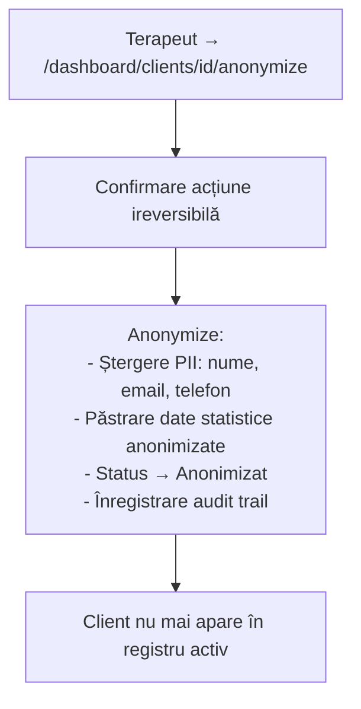

# Flux 01 — Lifecycle Client

## Descriere

Fiecare client trece printr-un ciclu de viață explicit, urmărit persistent în Supabase (`clients.status` + tabel `client_status_history`). Stările sunt derivate din acțiuni reale (onboarding finalizat, programare creată, ședință completată, inactivitate) și nu din input manual arbitrar.

## Fișiere Cheie

- [src/lib/clients/lifecycle.ts](../src/lib/clients/lifecycle.ts) — logica stărilor
- [src/lib/clients/lifecycle-sync.ts](../src/lib/clients/lifecycle-sync.ts) — sincronizare pe acțiuni UI
- [src/lib/clients/queries.ts](../src/lib/clients/queries.ts) — `getClientStatusHistory()` cu fallback sigur
- [src/components/clients/types.ts](../src/components/clients/types.ts) — `ClientStatusHistoryItem`
- [src/components/clients/ClientsClient.tsx](../src/components/clients/ClientsClient.tsx) — registru cu filtrare
- [src/components/clients/ClientDashboardUI.tsx](../src/components/clients/ClientDashboardUI.tsx) — fișa client cu acțiuni lifecycle + secțiune "Istoric lifecycle"
- [src/app/dashboard/clients/[id]/page.tsx](../src/app/dashboard/clients/[id]/page.tsx) — fetch paralel `getClientStatusHistory`
- [supabase/migrations/20260429223610_client_lifecycle_status.sql](../supabase/migrations/20260429223610_client_lifecycle_status.sql) — schema `client_status_history`

## Diagrama Stărilor



## Tranziții și Triggeruri

| Din stare | Către stare | Trigger | Fișier |
|-----------|-------------|---------|--------|
| *(nou)* | **Lead nou** | `clients/new` sau `clients/new-minor` | `clients/actions.ts` |
| *(nou)* | **Onboarding** | booking public `/book` | `api/bookings/create` |
| Lead nou | **Onboarding** | terapeut generează token onboarding | `onboarding-actions.ts` |
| Onboarding | **Programat** | onboarding finalizat + programare existentă | `lifecycle-sync.ts` |
| Programat | **Activ** | ședință marcată completă | `session-actions.ts` |
| Activ | **Inactiv** | job automat sau terapeut manual | `lifecycle.ts` |
| Activ | **Incheiat** | `markIncheiat()` din fișa client | `ClientDashboardUI.tsx` |
| Activ | **Neconversie** | `markNeconversie()` | `ClientDashboardUI.tsx` |
| Inactiv | **Activ** | `reactivate()` | `ClientDashboardUI.tsx` |
| Orice | **Anonimizat** | `/dashboard/clients/[id]/anonymize` | `anonymize/page.tsx` |

## Vizualizare în UI



## Date Istorice — Schema și Query

Tipul `ClientStatusHistoryItem` (din `src/components/clients/types.ts`):

```typescript
interface ClientStatusHistoryItem {
  id: string;
  from_status: string | null;   // null la prima tranziție (stare inițială)
  to_status: string;
  reason: string | null;        // fallback UI: "Fără motiv explicit"
  changed_at: string;           // ISO string, formatat cu date-fns ro
  changed_by_name: string | null; // extras din metadata.changed_by_name
}
```

Query în `getClientStatusHistory()`:
- Sursă: `client_status_history` WHERE `client_id = ?`
- Ordine: `changed_at DESC` (cel mai recent primul)
- Limită: **8 intrări** (istoricul recent relevant)
- **Fallback sigur**: dacă tabela lipsește (migrare neaplicată), returnează `[]` fără eroare

### Tracking `changed_by_name`

Stocat în `metadata.changed_by_name` (JSONB existent — fără migrare nouă):

```
lifecycle-sync.ts
  ├── fetchTherapistDisplayName(supabase, userId)
  │     └── SELECT full_name FROM therapist_settings WHERE therapist_id = userId
  │
  ├── syncClientLifecycleStatus() → auth.getUser() → fetchName → merge în metadata
  └── setClientLifecycleStatus()  → auth.getUser() → fetchName → merge în metadata
```

- Acțiuni din dashboard (terapeut autentificat) → înregistrează numele terapeutului
- Acțiuni de sistem/public (service role, fără sesiune) → `changed_by_name` absent → UI nu afișează nimic

## KPI-uri în Registrul de Clienți



## Anonimizare (GDPR)


