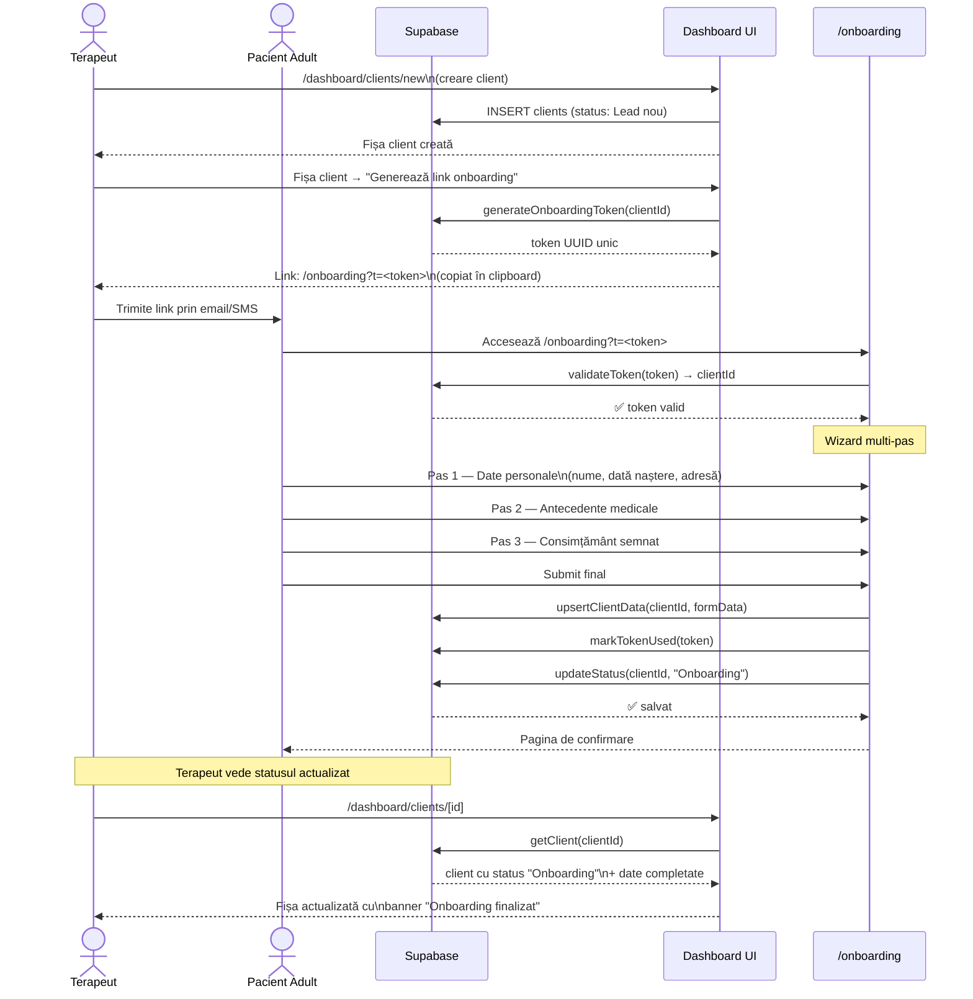
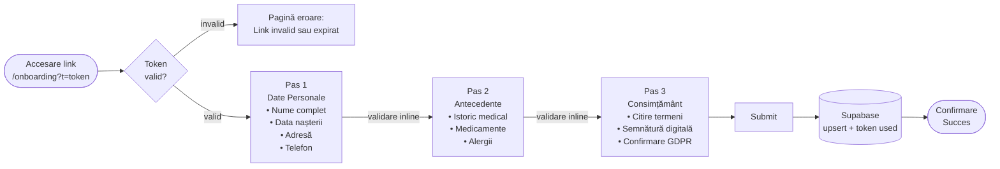
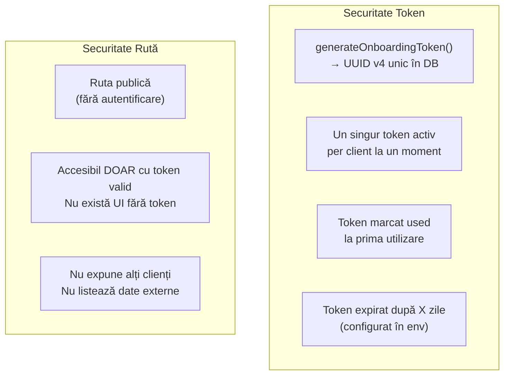

# Flux 02 — Onboarding Pacient Adult

## Descriere

Onboarding-ul pentru adulți este un flux cu doi actori: terapeutul inițiază din dashboard, pacientul finalizează pe un link public securizat cu token. Fluxul garantează că datele clinice ajung în fișa corectă fără a expune date despre alți clienți.

## Fișiere Cheie

- [src/app/onboarding/page.tsx](../src/app/onboarding/page.tsx) — pagina publică
- [src/components/onboarding/ClientOnboardingWizard.tsx](../src/components/onboarding/ClientOnboardingWizard.tsx) — wizard multi-pas
- [src/app/dashboard/clients/onboarding-actions.ts](../src/app/dashboard/clients/onboarding-actions.ts) — generare token, confirmare
- [src/lib/security/public-links.ts](../src/lib/security/public-links.ts) — generare și validare token
- [src/lib/clients/lifecycle-sync.ts](../src/lib/clients/lifecycle-sync.ts) — tranziție status la finalizare

## Diagrama Flux

## Pașii Wizard-ului de Onboarding

## Reguli de Securitate

## Validare pe Pași

- Fiecare pas este validat inline înainte de a permite trecerea la pasul următor
- Erorile sunt afișate inline (nu `alert()`)
- Utilizatorul nu poate sări un pas incomplet
- Datele sunt salvate la submit final, nu pas cu pas (evitare date parțiale)
