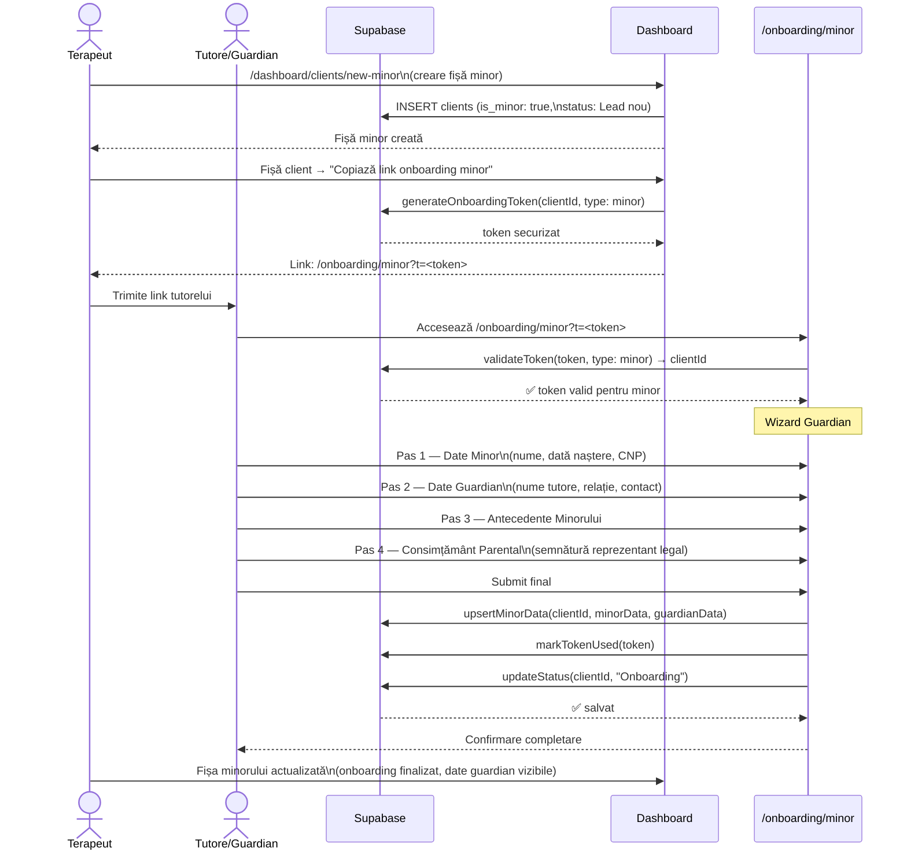
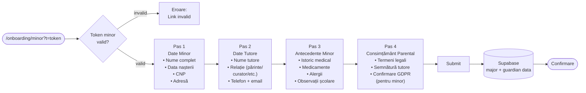
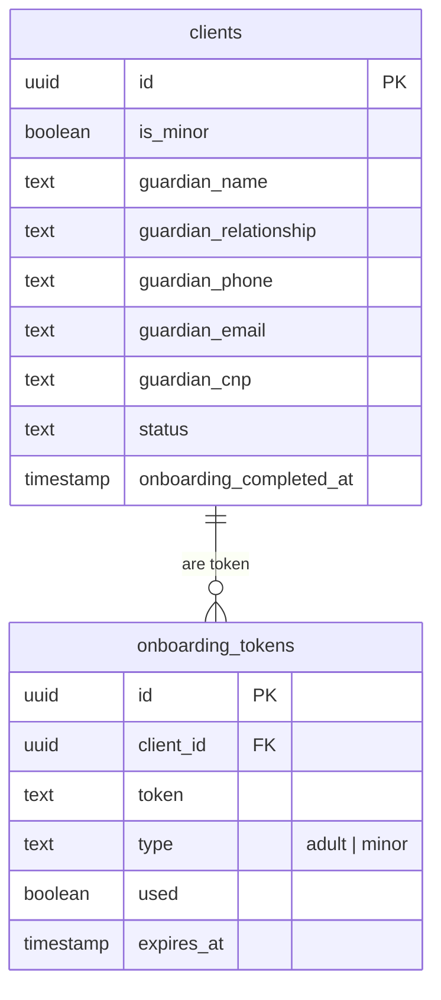

# Flux 03 — Onboarding Pacient Minor

## Descriere

Onboarding-ul pentru minori diferă de cel adult prin: participarea tutorelui/reprezentantului legal (nu minorul), câmpuri specifice de guardian, și condiții legale de consimțământ distinct. Ruta publică funcționează **doar** cu token securizat — nu există formular generic public pentru minori.

## Fișiere Cheie

- [src/app/onboarding/minor/page.tsx](../src/app/onboarding/minor/page.tsx) — pagina publică minor
- [src/components/onboarding/MinorOnboardingWizard.tsx](../src/components/onboarding/MinorOnboardingWizard.tsx) — wizard tutore
- [src/app/dashboard/clients/new-minor/page.tsx](../src/app/dashboard/clients/new-minor/page.tsx) — creare minor în dashboard
- [src/app/dashboard/clients/onboarding-actions.ts](../src/app/dashboard/clients/onboarding-actions.ts) — token minor
- [supabase/migrations/20260425234603_backfill_legacy_minor_guardian_fields.sql](../supabase/migrations/20260425234603_backfill_legacy_minor_guardian_fields.sql) — câmpuri guardian

## Diferențe față de Onboarding Adult

| Aspect | Adult | Minor |
|--------|-------|-------|
| Actor public | Pacientul însuși | Tutorele / Reprezentantul legal |
| Câmpuri | Date personale pacient | Date pacient + date guardian |
| Consimțământ | Auto-consimțământ | Consimțământ parental |
| Rută publică | `/onboarding?t=` | `/onboarding/minor?t=` |
| Creare dashboard | `/dashboard/clients/new` | `/dashboard/clients/new-minor` |
| Fallback public | NU (doar cu token) | NU (doar cu token) |

## Diagrama Flux



## Pașii Wizard-ului pentru Tutore



## Câmpuri Guardian în Schema DB



## Banner în Fișa Clientului Minor

Când onboarding-ul **nu** este finalizat, fișa clientului minor afișează un CTA explicit:

```
┌─────────────────────────────────────────────────────┐
│ ⚠️  Onboarding necompletat                          │
│                                                     │
│ Trimite link-ul de onboarding tutorelui pentru      │
│ a completa datele pacientului minor.                │
│                                                     │
│ [📋 Copiază link onboarding minor]                  │
└─────────────────────────────────────────────────────┘
```
