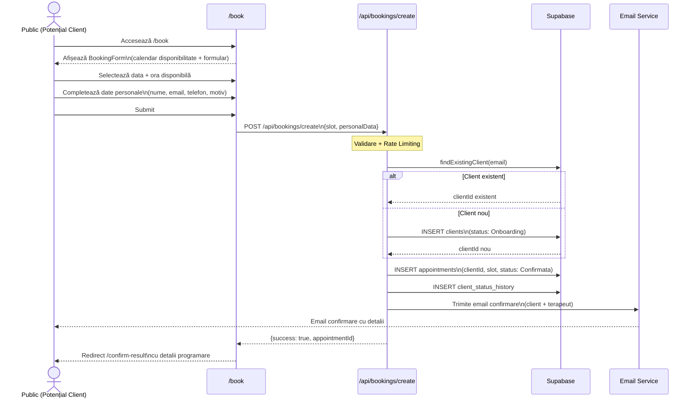
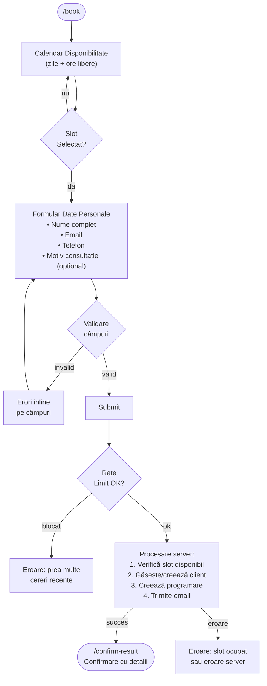
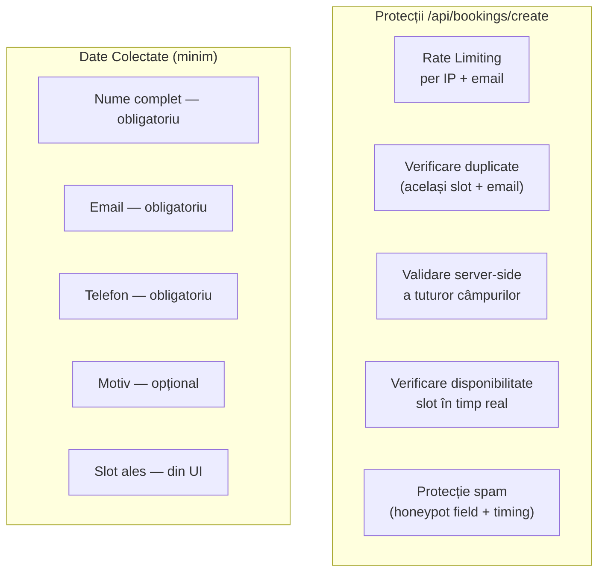
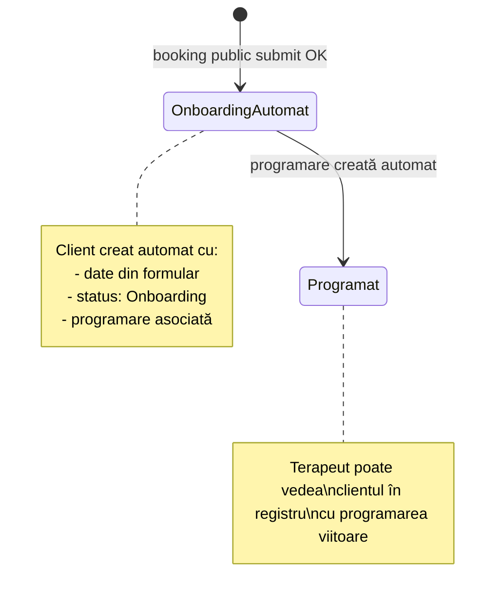

# Flux 04 — Programare Publică (Booking Widget)

## Descriere

Booking-ul public permite oricui să se programeze fără autentificare, prin widget-ul disponibil la `/book`. La submit, sistemul creează automat un client nou (sau îl identifică pe cel existent) și o programare asociată. Este singurul punct de intrare în sistem fără token.

## Fișiere Cheie

- [src/app/book/page.tsx](../src/app/book/page.tsx) — pagina publică booking
- [src/components/booking/BookingForm.tsx](../src/components/booking/BookingForm.tsx) — formular booking
- [src/components/booking/booking-widget.tsx](../src/components/booking/booking-widget.tsx) — widget embedding
- [src/app/api/bookings/create/route.ts](../src/app/api/bookings/create/route.ts) — API endpoint creare
- [src/lib/booking/](../src/lib/booking/) — logica de business booking
- [src/lib/security/](../src/lib/security/) — rate limiting, validare
- [src/app/confirm-result/page.tsx](../src/app/confirm-result/page.tsx) — pagina confirmare

## Diagrama Flux Principal



## Diagrama Flux Booking Form (UI)



## Securitate Booking Public



## Starea Clientului după Booking Public



## Pagina de Confirmare

La finalul unui booking reușit, `/confirm-result` afișează:

```
┌─────────────────────────────────────────────────────┐
│ ✅ Programare confirmată!                            │
│                                                     │
│ Data:   Joi, 15 Mai 2025                            │
│ Ora:    10:00                                       │
│ Locație: Cabinet Str. Exemplu nr. 1                 │
│                                                     │
│ Un email de confirmare a fost trimis la             │
│ email@exemplu.ro                                    │
│                                                     │
│ Vă așteptăm!                                        │
└─────────────────────────────────────────────────────┘
```
