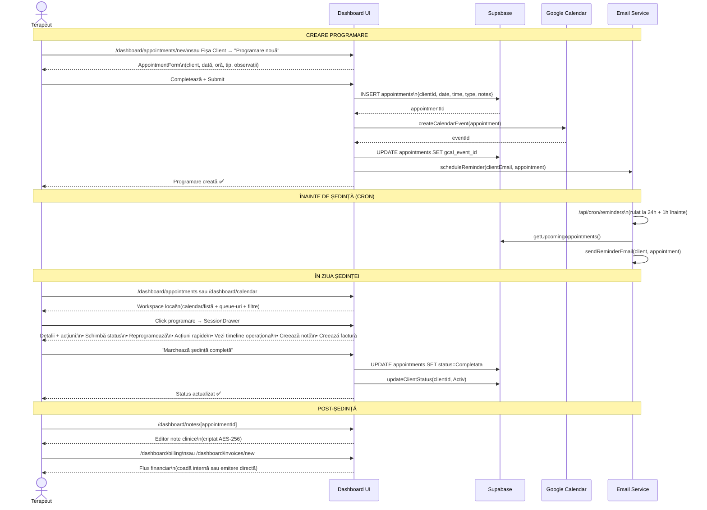
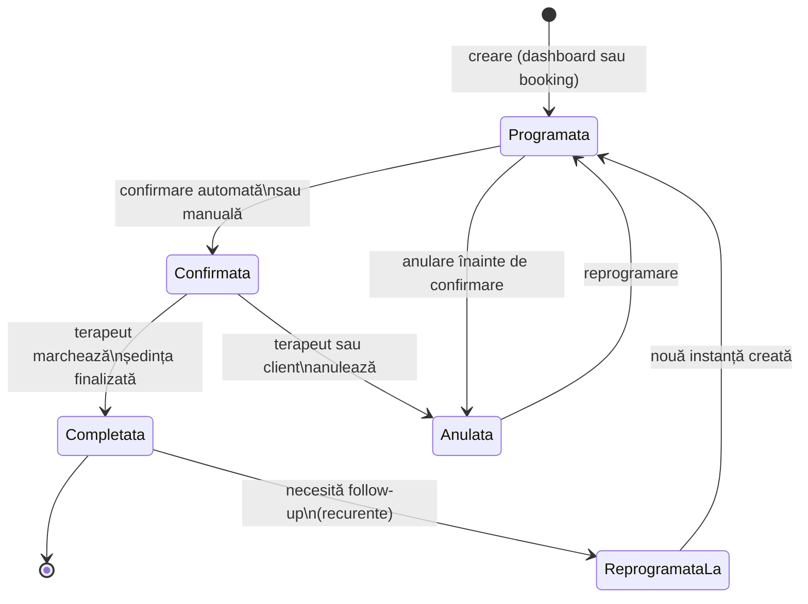
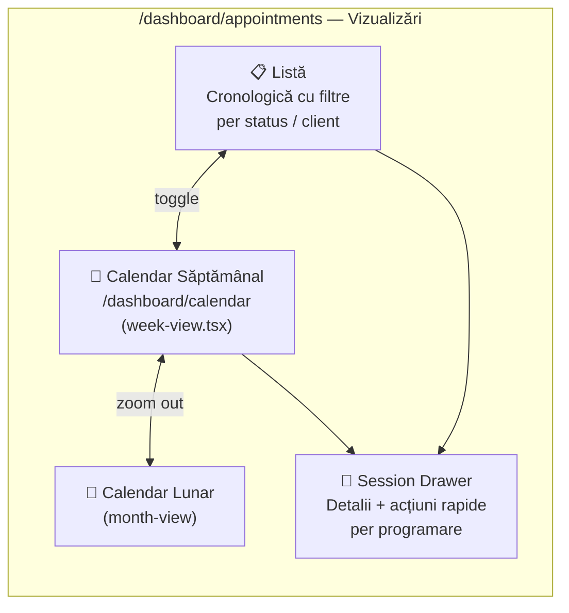
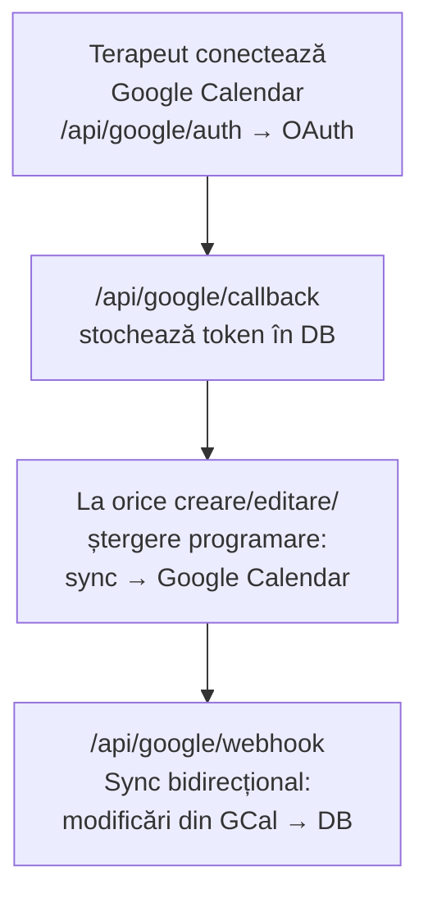
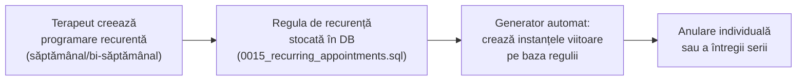
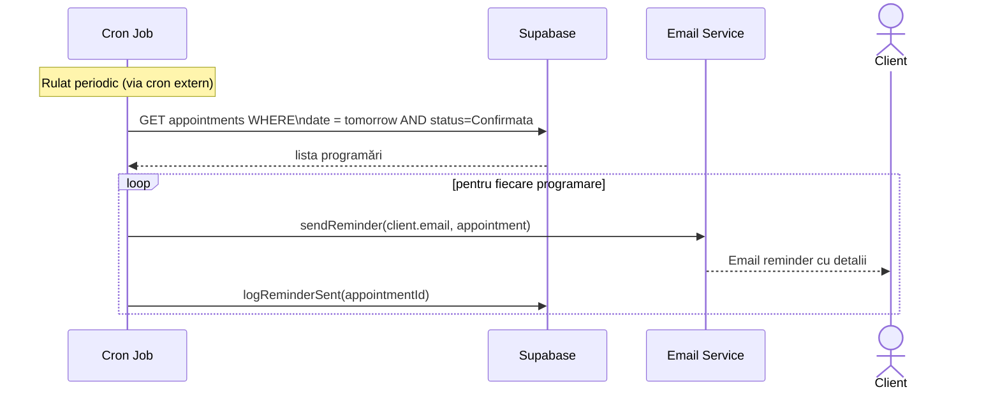

# Flux 05 — Management Programări (Ședințe)

## Descriere

Programările sunt nucleul operațional al cabinetului. Pot fi create de terapeut (din dashboard) sau de client (booking public). Sunt sincronizate cu Google Calendar, generează remindere automate prin email, și sunt legate de note clinice și facturi. În starea actuală, suprafața principală nu mai este doar pagina de detaliu, ci un workspace local cu overlay operațional care permite lucru rapid fără refresh complet de pagină.

## Fișiere Cheie

- [src/app/dashboard/appointments/](../src/app/dashboard/appointments/) — paginile de programări
- [src/components/appointments/appointment-form.tsx](../src/components/appointments/appointment-form.tsx) — formular creare/editare
- [src/components/appointments/SessionDrawer.tsx](../src/components/appointments/SessionDrawer.tsx) — drawer detalii ședință
- [src/components/appointments/AppointmentsWorkspace.tsx](../src/components/appointments/AppointmentsWorkspace.tsx) — workspace local pentru filtre, queue-uri, view și session overlay
- [src/app/dashboard/appointments/actions.ts](../src/app/dashboard/appointments/actions.ts) — Server Actions CRUD
- [src/app/dashboard/appointments/session-actions.ts](../src/app/dashboard/appointments/session-actions.ts) — acțiuni ședință
- [src/app/api/cron/reminders/route.ts](../src/app/api/cron/reminders/route.ts) — remindere automate
- [src/lib/google/](../src/lib/google/) — integrare Google Calendar

## Diagrama Flux Complet

## Contract UX Curent

- `/dashboard/appointments` funcționează ca workspace local:
  - schimbarea între `calendar` și `listă` nu face refresh
  - schimbarea între `queue` și `status` nu face refresh
  - deschiderea programării se face în `SessionDrawer`, nu prin navigare grea
- URL-ul rămâne sincronizat pentru share/back-forward, dar prin `history.replaceState`
- Dacă încărcarea Supabase eșuează temporar, pagina nu mai cade; afișează fallback și listă goală

## Queue-uri Operaționale

- `all` — registrul complet
- `today` — programările din ziua curentă
- `to-confirm` — programări care trebuie confirmate
- `needs-note` — ședințe finalizate fără notă
- `needs-invoice` — ședințe finalizate fără factură
- `overdue` — programări rămase în urmă față de flux
- `online` — ședințe cu context remote

## Session Drawer — Rol Actual

- `SessionDrawer` este overlay-ul principal al fluxului de programări
- oferă:
  - `next best action`
  - schimbări de status
  - `Reconfirmă / Anulează / Marchează lipsă / Mută pe follow-up`
  - reprogramează inline
  - timeline operațional derivat din notele interne
- acțiunile rapide și butoanele clasice de status scriu în același istoric operațional

## Stările unei Programări

## Tipuri de Vizualizare

## Integrare Google Calendar

## Programări Recurente

## Remindere Automate (Cron)

