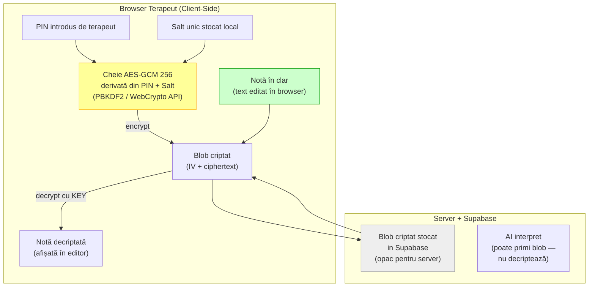
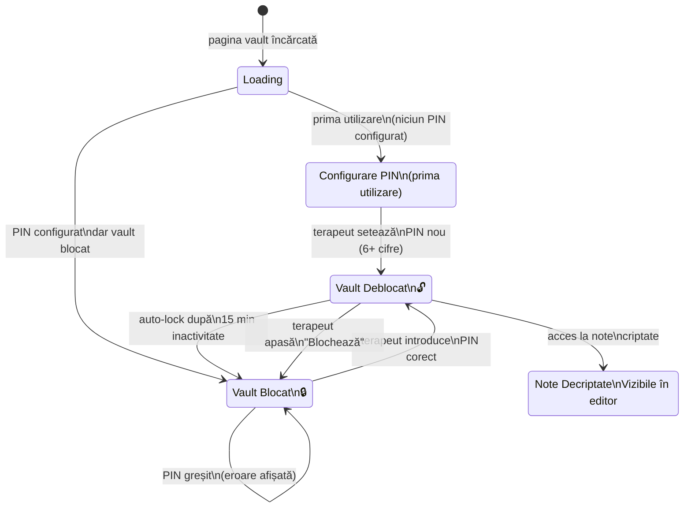
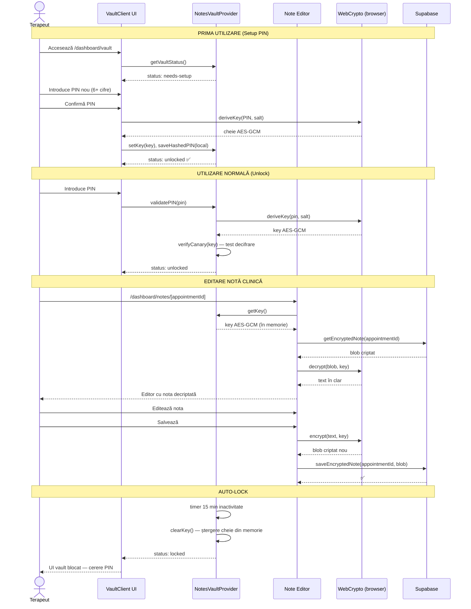
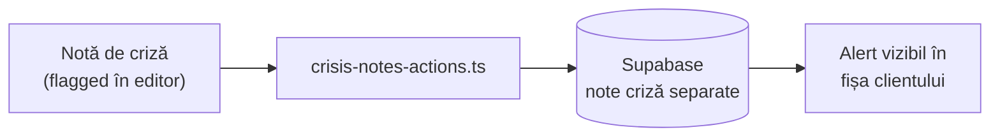
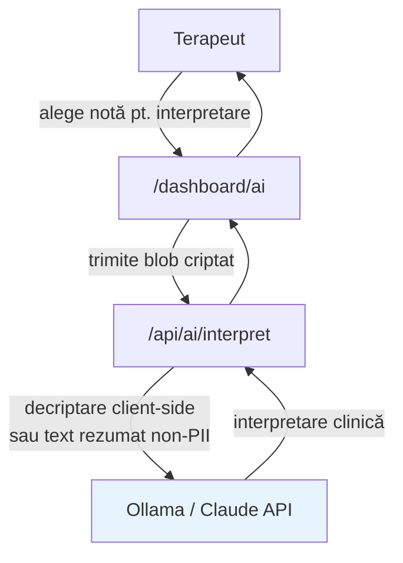

# Flux 06 — Note Clinice Criptate + Vault PIN

## Descriere

Notele clinice sunt criptate end-to-end folosind AES-GCM 256. Cheia de criptare este derivată din PIN-ul terapeututlui pe client (browserul terapeututlui) — serverul nu vede niciodată cheia sau conținutul în clar. Vault-ul se blochează automat după 15 minute de inactivitate.

## Fișiere Cheie

- [src/app/dashboard/vault/page.tsx](../src/app/dashboard/vault/page.tsx) — pagina vault
- [src/components/vault/VaultClient.tsx](../src/components/vault/VaultClient.tsx) — UI vault
- [src/components/notes/notes-context.tsx](../src/components/notes/notes-context.tsx) — NotesVaultProvider (context global)
- [src/components/notes/note-editor.tsx](../src/components/notes/note-editor.tsx) — editor note criptate
- [src/lib/notes/](../src/lib/notes/) — criptare AES-GCM 256
- [src/app/dashboard/notes/actions.ts](../src/app/dashboard/notes/actions.ts) — Server Actions (salvare blob criptat)
- [src/app/dashboard/vault/vault-actions.ts](../src/app/dashboard/vault/vault-actions.ts) — acțiuni vault

## Diagrama Criptare (Securitate)

## Stările Vault-ului

## Flux Complet — De la PIN la Notă

## Note de Criză

## AI Interpret (Opțional)

## Caracteristici Securitate

| Proprietate | Implementare |
|-------------|-------------|
| Algoritm criptare | AES-GCM 256 |
| Derivare cheie | PBKDF2 din PIN + salt unic |
| Stocare cheie | Numai în memorie (nu localStorage) |
| Verificare PIN | Canary bytes — test decifrare fără a expune date |
| Auto-lock | 15 minute inactivitate (configurable) |
| Server access | Server vede doar blob opac (nu poate decripta) |
| Backup cheie | Niciun backup — PIN pierdut = date inaccesibile |
