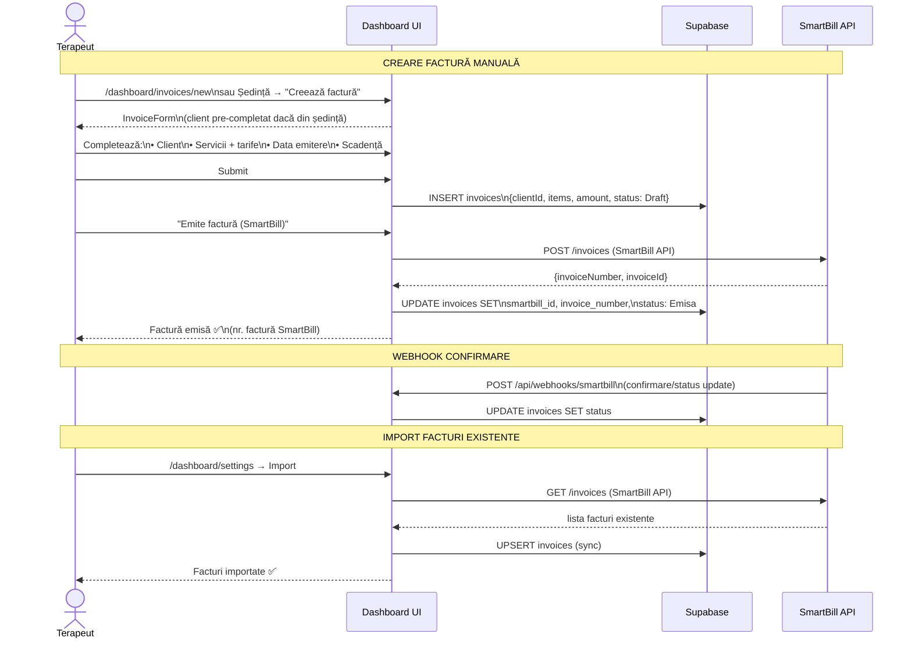
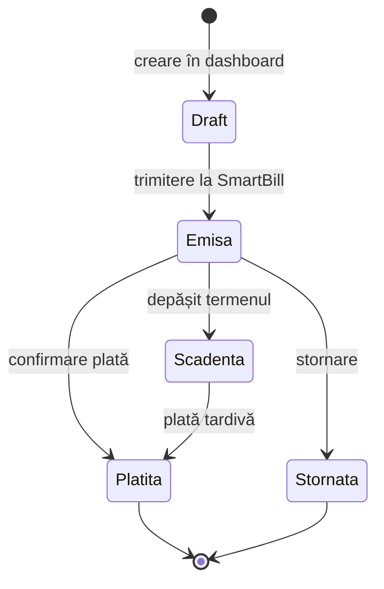
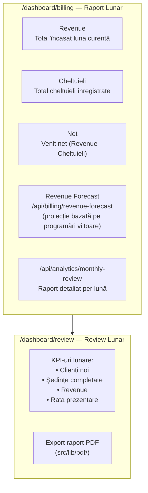
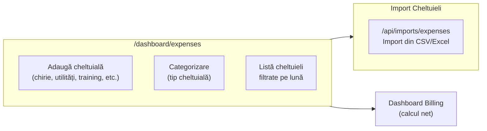
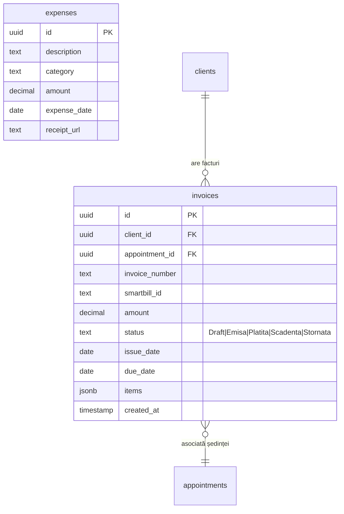
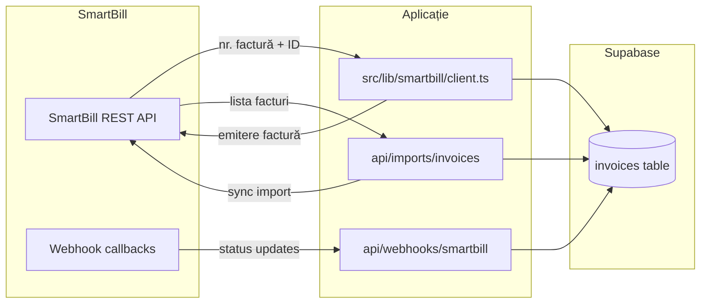

# Flux 07 — Facturare + SmartBill

## Descriere

Facturarea este gestionată intern cu SmartBill ca sistem extern de emitere. Terapeutul creează facturi din dashboard, acestea sunt trimise către SmartBill prin API, iar raportarea financiară (revenue forecast, cheltuieli, bilanț lunar) este generată intern.

## Fișiere Cheie

- [src/app/dashboard/invoices/](../src/app/dashboard/invoices/) — paginile de facturi
- [src/components/invoices/invoice-form.tsx](../src/components/invoices/invoice-form.tsx) — formular factură
- [src/components/invoices/invoice-actions.tsx](../src/components/invoices/invoice-actions.tsx) — acțiuni factură
- [src/app/dashboard/invoices/actions.ts](../src/app/dashboard/invoices/actions.ts) — Server Actions CRUD
- [src/lib/smartbill/](../src/lib/smartbill/) — client API SmartBill
- [src/app/api/webhooks/smartbill/route.ts](../src/app/api/webhooks/smartbill/route.ts) — webhook SmartBill
- [src/app/api/imports/invoices/route.ts](../src/app/api/imports/invoices/route.ts) — import facturi existente
- [src/app/dashboard/billing/page.tsx](../src/app/dashboard/billing/page.tsx) — raport financiar lunar
- [src/app/dashboard/expenses/](../src/app/dashboard/expenses/) — cheltuieli cabinet

## Diagrama Flux Facturare

## Stările unei Facturi

## Raportare Financiară

## Management Cheltuieli

## Schema Factură

## SmartBill Integration

