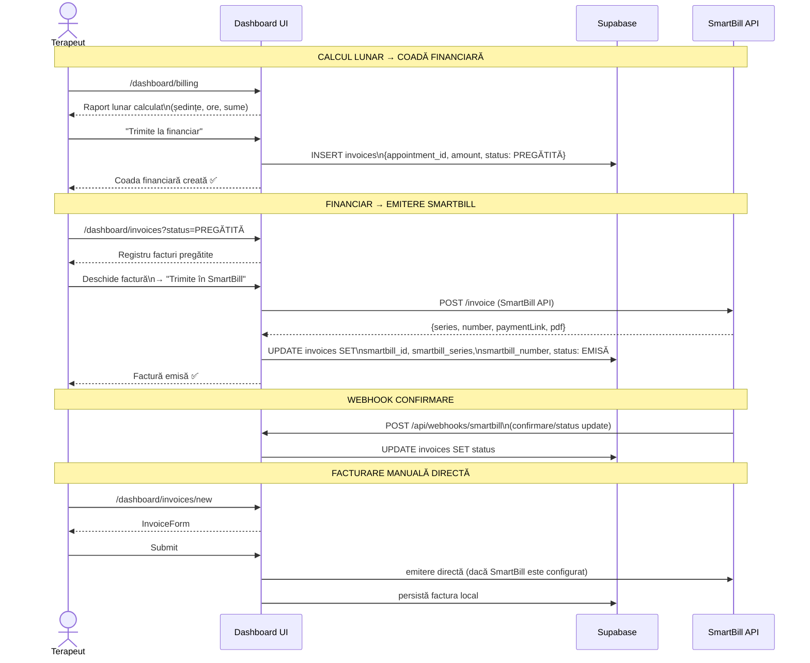
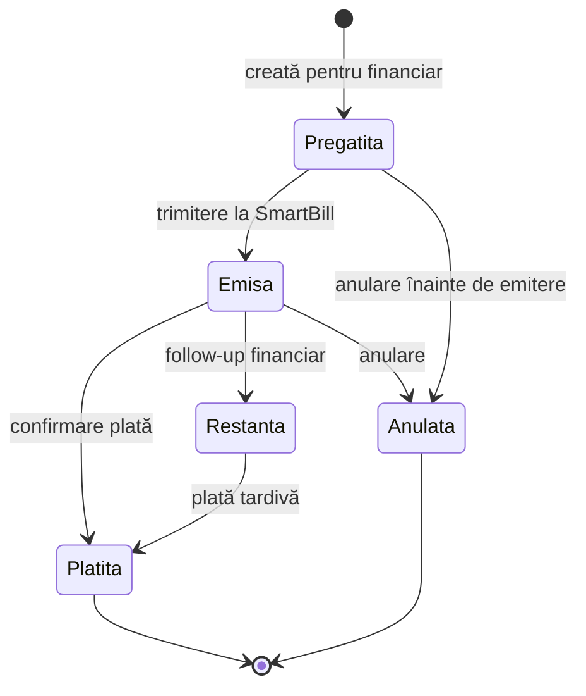
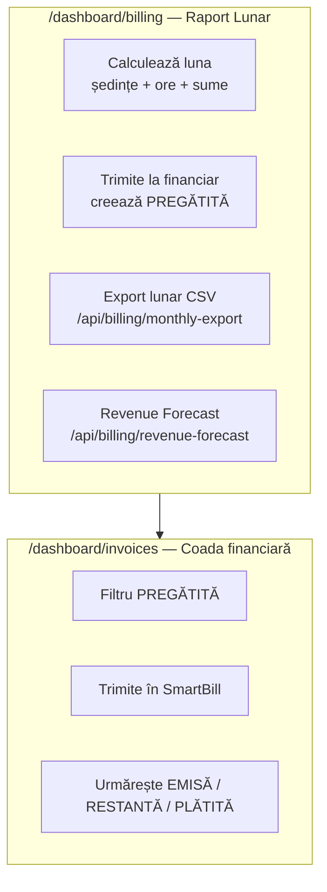
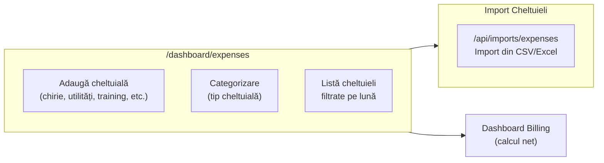
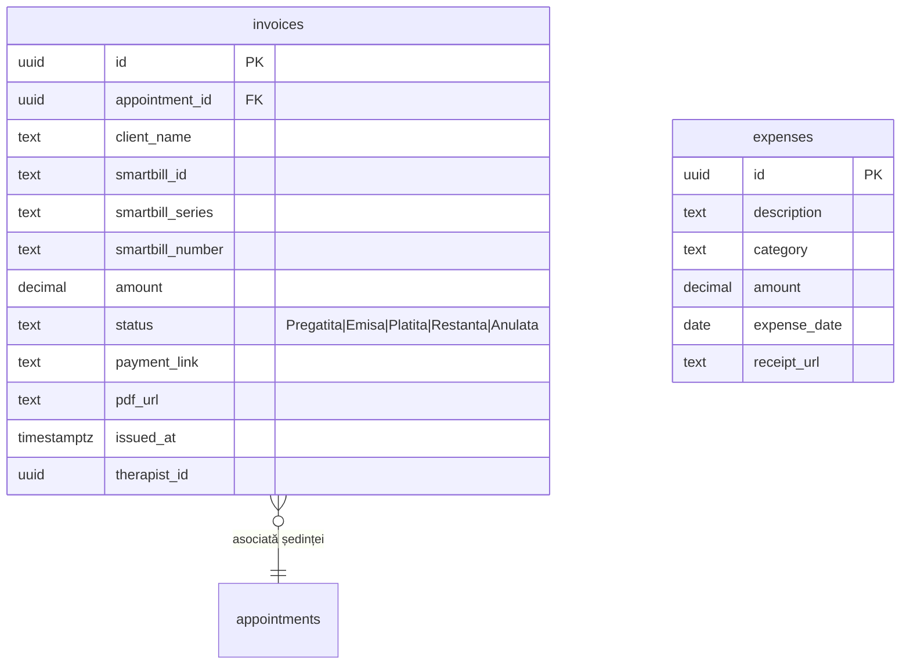
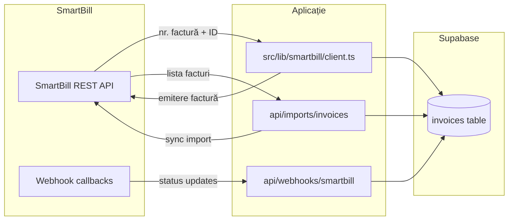

# Flux 07 — Facturare + SmartBill

## Descriere

Facturarea este gestionată intern cu SmartBill ca sistem extern de emitere. În starea actuală, aplicația separă clar trei etape:

1. calculul și închiderea lunii în `/dashboard/billing`;
2. pregătirea internă a facturilor pentru financiar, cu status local `PREGĂTITĂ`;
3. trimiterea efectivă în SmartBill din registrul de facturi.

## Fișiere Cheie

- [src/app/dashboard/invoices/](../src/app/dashboard/invoices/) — paginile de facturi
- [src/components/invoices/invoice-form.tsx](../src/components/invoices/invoice-form.tsx) — formular factură
- [src/components/invoices/invoice-actions.tsx](../src/components/invoices/invoice-actions.tsx) — acțiuni factură
- [src/app/dashboard/invoices/actions.ts](../src/app/dashboard/invoices/actions.ts) — Server Actions CRUD
- [src/lib/billing/monthly-summary.ts](../src/lib/billing/monthly-summary.ts) — sursa comună pentru sumarul lunar
- [src/lib/smartbill/](../src/lib/smartbill/) — client API SmartBill
- [src/app/api/webhooks/smartbill/route.ts](../src/app/api/webhooks/smartbill/route.ts) — webhook SmartBill
- [src/app/api/billing/monthly-export/route.ts](../src/app/api/billing/monthly-export/route.ts) — export lunar CSV
- [src/app/dashboard/billing/page.tsx](../src/app/dashboard/billing/page.tsx) — raport financiar lunar
- [src/app/dashboard/expenses/](../src/app/dashboard/expenses/) — cheltuieli cabinet

## Diagrama Flux Facturare

## Stările unei Facturi

## Raportare Financiară

## Management Cheltuieli

## Schema Factură

## Contract UX Curent

- `/dashboard/billing` este suprafața de calcul și închidere lunară
- `Trimite la financiar` nu trimite direct în SmartBill; doar pregătește coada internă
- `/dashboard/invoices` este spațiul financiar de control operațional
- `PREGĂTITĂ` înseamnă:
  - factura există local
  - este asociată unei programări
  - poate fi verificată de financiar
  - abia apoi este emisă în SmartBill

## SmartBill Integration

