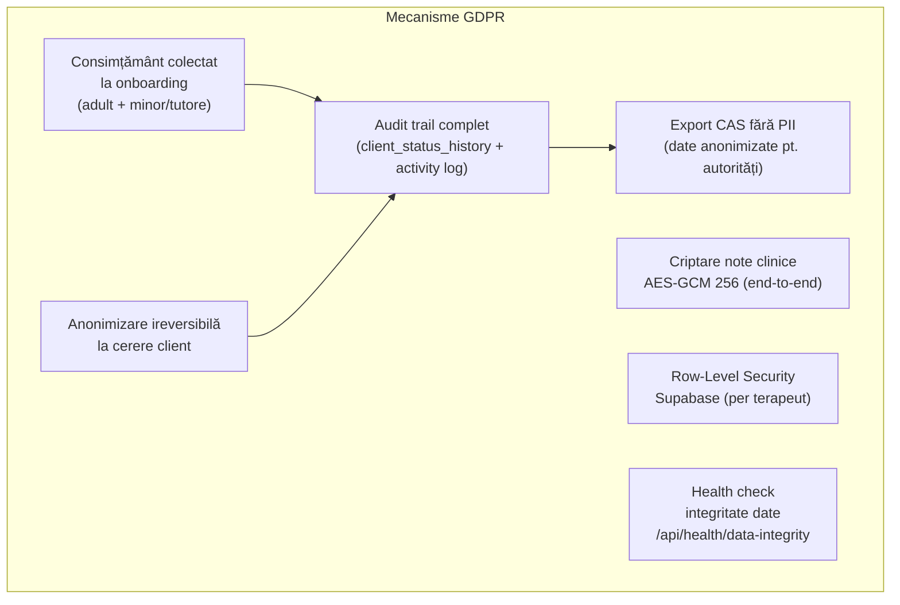
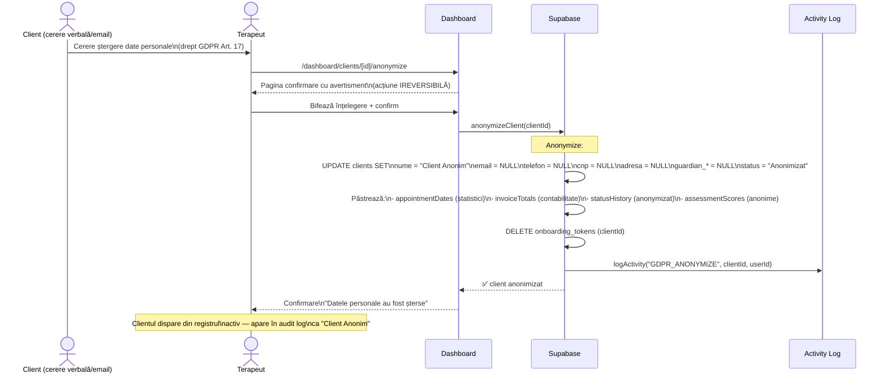
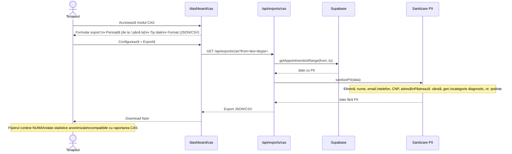
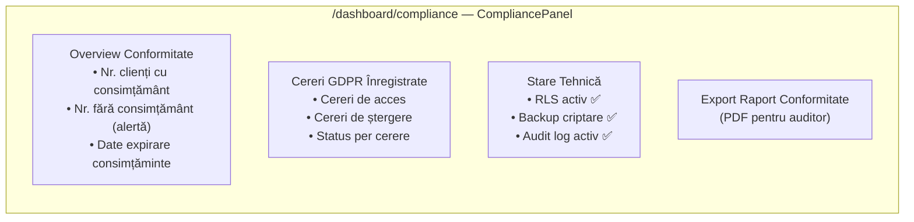
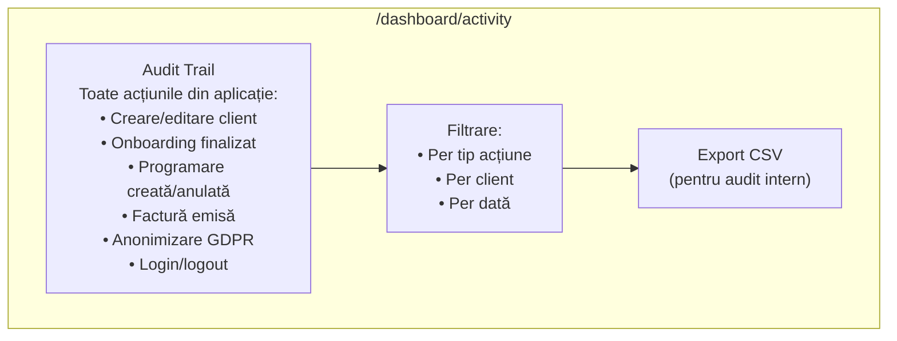
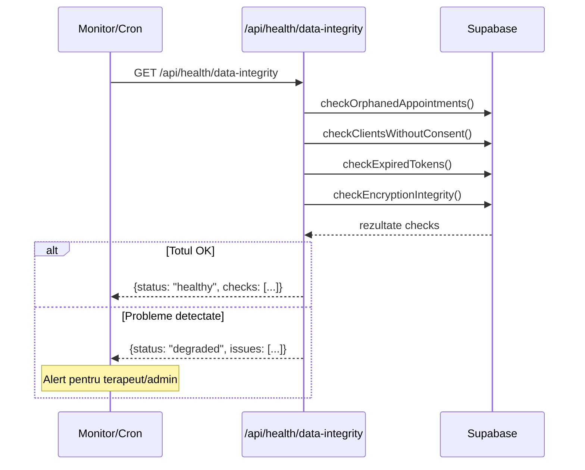
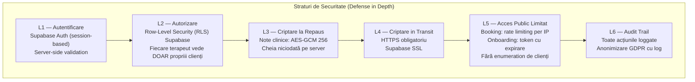
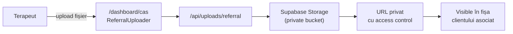

# Flux 08 — Conformitate GDPR, CAS Export, Anonimizare

## Descriere

Aplicația este construită cu conformitate GDPR ca cerință de design, nu ca adăugire ulterioară. Există trei mecanisme principale: panoul de conformitate pentru audit vizual, exportul CAS fără PII pentru autorități, și anonimizarea ireversibilă a clienților la cerere.

## Fișiere Cheie

- [src/app/dashboard/compliance/page.tsx](../src/app/dashboard/compliance/page.tsx) — panou conformitate
- [src/components/compliance/CompliancePanel.tsx](../src/components/compliance/CompliancePanel.tsx) — UI GDPR
- [src/lib/compliance/](../src/lib/compliance/) — engine GDPR + sanitizare PII
- [src/app/dashboard/cas/](../src/app/dashboard/cas/) — modul CAS
- [src/components/cas/CasModuleUI.tsx](../src/components/cas/CasModuleUI.tsx) — UI export CAS
- [src/components/cas/ReferralUploader.tsx](../src/components/cas/ReferralUploader.tsx) — upload referințe
- [src/app/api/exports/cas/route.ts](../src/app/api/exports/cas/route.ts) — API export CAS
- [src/app/dashboard/clients/[id]/anonymize/](../src/app/dashboard/clients/[id]/anonymize/) — anonimizare client
- [src/app/dashboard/activity/](../src/app/dashboard/activity/) — registru activitate
- [src/app/api/health/data-integrity/route.ts](../src/app/api/health/data-integrity/route.ts) — verificare integritate

## Diagrama Conformitate GDPR

## Flux Anonimizare Client (GDPR Delete Request)

## Export CAS (Sistemul de Asistență Socială)

## Panou Conformitate GDPR

## Registru de Activitate

## Health Check Date

## Straturi de Securitate

## Upload Referințe Medicale

