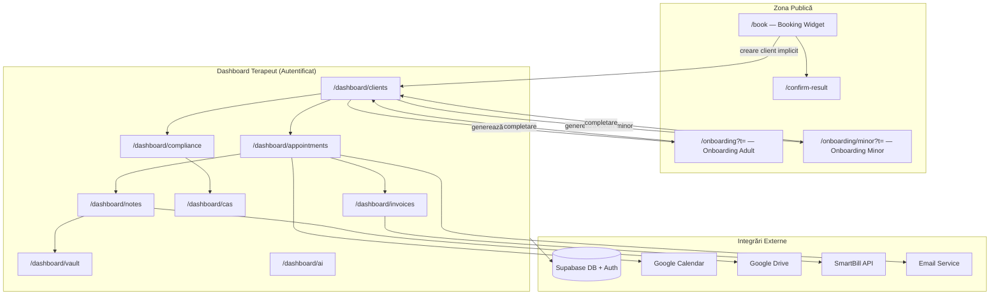
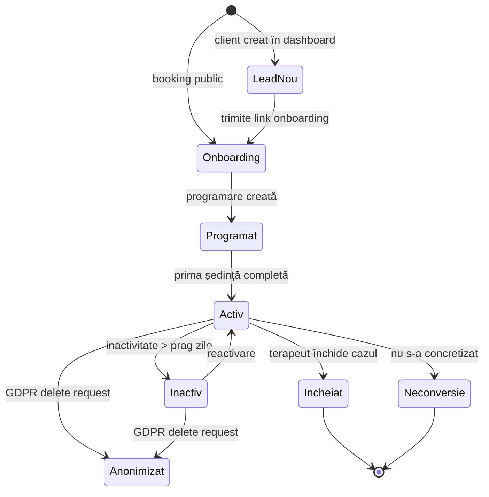

# Fluxuri Aplicatie — Ce'ai Pățit? ERP Cabinet Psihoterapie

Acest director conține documentația completă a fluxurilor operaționale ale aplicației.

## Flux Index

| Fișier | Flux | Tip Utilizator |
|--------|------|----------------|
| [01_lifecycle_client.md](01_lifecycle_client.md) | Lifecycle complet al unui client | Terapeut |
| [02_onboarding_adult.md](02_onboarding_adult.md) | Onboarding pacient adult | Pacient + Terapeut |
| [03_onboarding_minor.md](03_onboarding_minor.md) | Onboarding pacient minor | Tutore + Terapeut |
| [04_booking_public.md](04_booking_public.md) | Programare publică fără autentificare | Public |
| [05_programari.md](05_programari.md) | Management programări (ședințe) | Terapeut |
| [06_note_clinice_vault.md](06_note_clinice_vault.md) | Note clinice criptate + Vault PIN | Terapeut |
| [07_facturare.md](07_facturare.md) | Facturare + SmartBill | Terapeut |
| [08_compliance_gdpr.md](08_compliance_gdpr.md) | Conformitate GDPR, CAS export, Anonimizare | Terapeut |

## Document de plan servicii clinice

[docs/client-service-flows.md](../docs/client-service-flows.md) — Plan complet pentru cele 4 tipuri de servicii (Psihologie clinică, CBT, DBT, Consiliere) cu flow-uri, statusuri, documente, carduri UI, model de date și faze de implementare P0→P3.

---

## Arhitectura la Nivel Înalt

## Stările Lifecycle ale unui Client

## Utilizatori și Roluri

| Utilizator | Acces | Entry Point |
|------------|-------|-------------|
| **Terapeut** | Dashboard complet (autentificat) | `/login` → `/dashboard` |
| **Pacient Adult** | Formular onboarding cu token | `/onboarding?t=<token>` |
| **Tutore Minor** | Formular onboarding minor cu token | `/onboarding/minor?t=<token>` |
| **Public** | Booking widget | `/book` |
