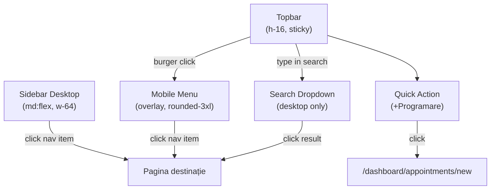

# Navigație

## Fișiere cheie

- [src/components/dashboard/nav-groups.ts](../src/components/dashboard/nav-groups.ts) — definiția grupurilor nav
- [src/components/dashboard/sidebar.tsx](../src/components/dashboard/sidebar.tsx) — sidebar desktop
- [src/components/dashboard/topbar.tsx](../src/components/dashboard/topbar.tsx) — topbar + mobile menu

---

## Structura navigației (sidebar)

### Grupuri și itemi

```
Activitate Zilnică
  ├── Dashboard             /dashboard
  ├── Programări            /dashboard/appointments
  ├── Calendar              /dashboard/calendar
  ├── Note Clinice          /dashboard/notes
  └── Asistent AI           /dashboard/ai

Management Clienți
  ├── Clienți               /dashboard/clients
  ├── Documente             /dashboard/documents
  ├── Evaluări              /dashboard/assessments
  └── Seif Note             /dashboard/vault

Financiar & Administrativ
  ├── Facturi               /dashboard/invoices
  ├── Cheltuieli            /dashboard/expenses
  ├── Raportare             /dashboard/billing
  ├── Sumar Lunar           /dashboard/review
  └── CAS                   /dashboard/cas

Legal & Configurare
  ├── Registru Activitate   /dashboard/activity
  ├── Conformitate GDPR     /dashboard/compliance
  └── Setări                /dashboard/settings
```

### Tipul unui nav item

```typescript
type NavItem = {
  href: string;
  label: string;
  icon: LucideIcon;
};

type NavGroup = {
  label: string;
  items: NavItem[];
};
```

---

## Active State Detection

```typescript
function isActive(href: string, pathname: string): boolean {
  if (href === "/dashboard") {
    return pathname === "/dashboard"; // match exact
  }
  return pathname?.startsWith(href); // prefix match pentru subpagini
}
```

### Clase CSS pe stări

```tsx
<a
  href={item.href}
  className={cn(
    "flex items-center gap-3 rounded-xl px-3 py-2 text-sm font-medium transition-colors",
    isActive(item.href, pathname)
      ? "ui-nav-item-active"   // bg-primary/10 text-primary shadow-sm
      : "ui-nav-item-idle"     // text-muted-foreground hover:bg-accent hover:text-accent-foreground
  )}
>
  <item.icon className="h-4 w-4 shrink-0" />
  {item.label}
</a>
```

---

## Mobile Navigation

### Trigger

Buton burger în topbar (vizibil doar pe mobile):

```tsx
<button
  className="h-10 w-10 rounded-xl border border-border bg-background md:hidden"
  onClick={() => setMenuOpen(true)}
  aria-label="Deschide meniu"
>
  <Menu className="h-5 w-5" />
</button>
```

### Panel overlay

```
┌──────────────────────────────────────┐
│  Backdrop (blur + dimmer)            │
│  ┌────────────────────────────────┐  │
│  │  [X]  Închide                  │  │
│  │                                │  │
│  │  Activitate Zilnică            │  │
│  │  ○ Dashboard                   │  │
│  │  ○ Programări                  │  │
│  │                                │  │
│  │  Management Clienți            │  │
│  │  ○ Clienți                     │  │
│  │  ...                           │  │
│  └────────────────────────────────┘  │
└──────────────────────────────────────┘
```

**Backdrop:** `fixed inset-0 z-50 bg-slate-950/30 backdrop-blur-sm`

**Panel:**
```
absolute left-4 right-4 top-20
max-h-[calc(100svh-6rem)] overflow-y-auto
rounded-3xl border bg-card p-4 shadow-2xl
```

**Auto-close:** la click pe orice item de navigație (prin `onClick={() => setMenuOpen(false)}`)

**Group label în mobile:**
```
text-[10px] font-black uppercase tracking-widest
text-muted-foreground/60 mb-2 px-2
```

---

## Search Rapid (desktop)

Input de căutare în topbar, vizibil de la `md:`.

### Comportament

1. Utilizatorul scrie în input
2. Se filtrează live lista din `navGroups` (toate item-urile)
3. Maxim 6 rezultate în dropdown
4. Click pe rezultat → navigate + clear input
5. Submit form → navigate la primul rezultat

### Styling input

```
h-10 w-full rounded-md border border-input bg-background
pl-9 pr-3 text-sm
placeholder:text-muted-foreground
```

Icon `Search` poziționat stânga la `left-3`.

### Styling dropdown

```
absolute left-0 top-12 z-40
w-full max-w-md
rounded-2xl border bg-popover p-2 shadow-2xl
```

Fiecare rezultat:
```tsx
<button
  className="flex w-full items-center gap-3 rounded-xl px-3 py-2 text-sm hover:bg-accent"
>
  <Item.icon className="h-4 w-4 text-muted-foreground" />
  {item.label}
</button>
```

---

## Back Links (Breadcrumb minimal)

Pattern folosit în paginile cu context (fișă client, detaliu programare):

```tsx
<Button asChild variant="ghost" size="sm">
  <Link href="/dashboard/clients">
    <ArrowLeft className="h-4 w-4 mr-1" />
    Înapoi la clienți
  </Link>
</Button>
```

Nu există un component `Breadcrumb` dedicat. Pattern-ul este un buton ghost cu arrow stânga.

---

## Quick Actions (Topbar)

Buton fix în topbar pentru acțiunea cea mai frecventă:

```tsx
<Button size="sm" asChild>
  <Link href="/dashboard/appointments/new">
    <CalendarPlus className="h-4 w-4" />
    <span className="sm:inline hidden">Programare nouă</span>
  </Link>
</Button>
```

Textul e vizibil de la `sm:`, pe mobile apare doar icon.

---

## Vault Indicator (Topbar)

Componentă specială care indică starea seifului criptat:

- **Deblocat:** badge verde discret cu iconiță lacăt deschis
- **Blocat:** badge gri / fără indicator
- **Click:** navigare la `/dashboard/vault`

---

## Diagrama fluxului de navigare


